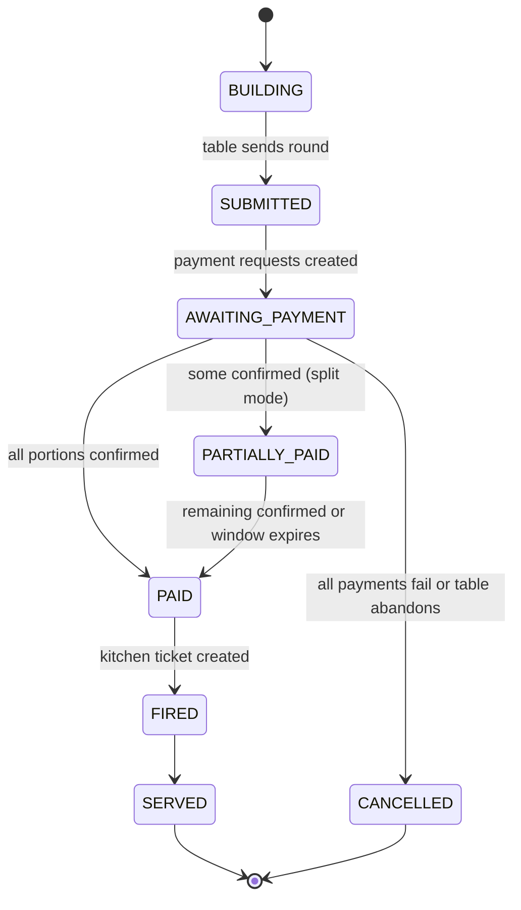

# OmniBite - Complete Build Specification
*A product by Omnilab*

A single consolidated reference for the OmniBite restaurant ordering and payment platform: features and phase plan, the phase-one order and payment state machine, the data model, and the M-Pesa and eTIMS integrations.

**Context (applies throughout):** Kenya, M-Pesa via the Daraja API, casual sit-down dining, web-based with no diner app download, Postgres backend.

**Reading order:**
1. Feature Specification - what OmniBite does and the three-phase plan
2. Phase 1 State Machine - how an order moves from scan to served, and where payment gates the kitchen
3. Phase 1 Data Model - the Postgres schema behind those states
4. M-Pesa (Daraja) Integration - collecting payment
5. eTIMS (KRA) Integration - issuing the tax invoice
6. Real-Time Layer and KDS - how paid tickets reach the kitchen and survive a reconnect

**Caveat for the two integrations:** the exact API field names and result codes are the shape, not gospel. Confirm against Safaricom's current Daraja docs and KRA's VSCU or OSCU spec before coding. The flows are stable; the specific strings drift.

<br>


---

# OmniBite
## Restaurant QR Ordering and Payment System - Feature Specification

OmniBite is a custom dine-in ordering, kitchen, and payment platform for multi-location restaurant groups in Kenya. Diners order from their table by QR, pay by M-Pesa before the kitchen cooks, track their order live, and leave without flagging down a waiter. The design removes dine-and-dash structurally and treats Kenyan tax, payment, and data law as core requirements, not afterthoughts.

Context assumptions: Kenya, M-Pesa via the Daraja API, casual sit-down dining, web-based with no app download for diners.

---

# Part A - Diner-facing

## 1. QR table ordering
- QR per table encodes location ID plus table ID. The diner scans, lands on that location's live menu, and joins that table's session. No app download.
- Placed items become a kitchen ticket carrying the table ID.
- The kitchen ticket fires only after payment confirms. No payment, no food. See Part B.

## 2. Shared table ordering (multiple diners, different meals)
- Everyone who scans the same table QR joins one shared session tied to that table ID.
- Each diner adds their own items from their own phone. Every item is tagged to the person who ordered it, which is what makes split payment work.
- Each diner pays their own portion by M-Pesa against the shared table ID.
- The kitchen holds and fires the whole table as one coursed ticket once the round is paid, so the table eats together rather than dishes trickling out per person.
- Later additions open a new paid round on the same session.

## 3. Order tracking
- The diner's screen moves through received, preparing, and ready.
- The time estimate comes from the kitchen's real queue depth plus a per-item prep time, never a fixed or customer-set number, and the kitchen can bump it when slammed.

## 4. Menu model
- Items carry photos, descriptions, price, and dietary and allergen tags. Allergens are a safety and legal matter, not optional.
- A modifier engine handles choices and add-ons (no onions, choose a side, combos, extras with price deltas).
- Real-time 86ing: when the kitchen marks an item out, it greys out across every active and incoming order at that location within seconds.

## 5. Diner extras
- Item-level feedback tied to the exact order and ticket, so a complaint points the kitchen at the specific dish.
- SMS receipt to the diner's phone, separate from the payment confirmation.
- English and Swahili menu toggle.
- Loyalty keyed to the M-Pesa phone number, so a returning diner's favorites and allergies surface on their tab.

---

# Part B - Payments and money

This is the heart of OmniBite and where most of the risk lives.

## 6. Pay-before-fire
- Placing an order triggers an STK push (Lipa na M-Pesa Online) to the diner's phone. They enter their M-Pesa PIN.
- The table ID rides in the account reference. The Daraja callback matches payment to table, marks the order paid, fires the kitchen ticket, and updates the floor map.
- Because food only cooks after payment confirms, there is never unpaid food on a table. Dine-and-dash is removed by design.
- M-Pesa has no card-style hold or pre-authorization, so pay-per-round is mandatory, not a preference.

## 7. M-Pesa reliability (the unhappy paths)
The happy path is the easy 20 percent. Build for the rest:
- Dropped callbacks: when no callback arrives in time, query the Daraja transaction status API to confirm the true outcome before deciding.
- Idempotency: dedupe on the transaction reference so a retried or duplicated callback never double-charges or double-fires.
- Customer non-action: handle ignored prompts, wrong PIN, insufficient balance, and timeouts with a clear retry path.
- Nightly reconciliation: an automated job matches the M-Pesa statement against OmniBite's recorded sales and flags any mismatch.

## 8. Mixed payment: M-Pesa, card, cash
The system must not assume M-Pesa only. A big restaurant serves tourists and cash payers.
- M-Pesa: primary, per round, as above.
- Card: a payment gateway for Visa and Mastercard, needed for tourists and corporate diners.
- Cash: a server-recorded cash path with drawer reconciliation at end of shift.
- One table can mix all three across its diners.

## 9. Refunds and failed orders
The necessary other half of pay-before-fire, since money is taken first.
- If the kitchen 86s an item after payment, or food comes out wrong, OmniBite owes a reversal.
- Offer store credit as the default remedy and a true M-Pesa reversal as the fallback, since reversals are slow and partly manual.
- Every refund is logged, reason-coded, and requires the right staff role. See Part D.

## 10. Split payment and tipping
- Multiple diners each fire their own STK push against the same table ID. The table clears only when the total is covered.
- Tips are added on top and paid in the same push.

## 11. eTIMS tax invoicing (legally mandatory)
Every sale in Kenya requires a real-time electronic tax invoice transmitted to KRA, whether paid by M-Pesa, card, or cash.
- OmniBite generates a compliant invoice through the eTIMS API at the moment of payment.
- The invoice carries the required fields: seller PIN, buyer PIN where the buyer claims input tax, tax amounts, item code and description, quantity, unit, tax rate, a unique system identifier, and a QR code.
- Non-compliance risk is real: penalties reach KES 1 million or 10 percent of the tax involved, and from the 2026 year of income KRA validates declared income against eTIMS records.
- This is a phase-one requirement, not a later add-on.

---

# Part C - Kitchen and floor

## 12. Kitchen Display System
- Tickets split by station (grill, cold, fry, pass), age in real time, bump when done. Replaces paper.
- Coursing and holds: apps fire now, mains fire on a server signal or timer. Shared table tickets fire as one unit.
- Pacing: ticket throttling during a rush plus per-station load balancing.
- Offline resilience: the display queues tickets locally and syncs on reconnect. A paid ticket must never be lost.

## 13. Front desk and floor
- Table state as source of truth: open, seated, ordered, food running, check dropped, paid, needs bussing.
- Floor map shows every table's state, including paid versus unpaid.
- Server app runs the same table state, so QR orders and server-entered orders land in one tab with no reconciliation.
- Call-staff button pings the floor map, not the kitchen, since QR removes the waiter but diners still need help.
- Reservations and waitlist with SMS notifications, feeding the same table state.

---

# Part D - Controls, compliance, and security

## 14. Staff roles and internal controls
The classic restaurant fraud is staff, not diners.
- Role-based permissions for who can void, comp, refund, or override a price.
- Manager PIN for sensitive actions.
- An immutable audit log of every void, comp, refund, and override, with who and when.

## 15. Data protection (Data Protection Act 2019)
Collecting phone numbers, payment data, and loyalty profiles makes the restaurant a data controller.
- Register with the ODPC and capture clear consent for loyalty and marketing.
- Minimize stored data, secure it, and define retention and deletion rules.

## 16. QR tamper protection
A static printed QR is an attack surface: someone can paste a fake code pointing at their own till over your table sticker and skim payments.
- Table codes are validated server-side so a spoofed or altered code fails to open a session.
- Periodic rotation or signed codes for higher-risk locations.

## 17. Full-outage mode
Power and internet both drop in parts of Kenya.
- A degraded manual path lets the floor keep taking orders and payments, with reconciliation into OmniBite once connectivity returns.

---

# Part E - Group scale

## 18. Multi-location and menu engine
- Group master menu with per-location overrides on price and availability.
- Dayparting: different menus and prices by time of day.
- Dynamic pricing: scheduled or rule-based changes.

## 19. Delivery injection
Inject third-party orders into the same kitchen display so the kitchen works one queue.
- Glovo first. It leads the Kenyan market at roughly a third of orders.
- Then Uber Eats and Bolt Food, second and third by share.
- Ignore Jumia Food, which shut down its African operations in December 2023.

## 20. Catering and advance bulk orders
Large orders for events, offices, and functions. A separate subsystem, not the table flow.
- Separate entry point, no table ID. Captures fulfillment type, date and time, quantities, and contact phone.
- Lead-time rules per item and slot capacity caps so the kitchen is never oversold.
- Full prepayment by M-Pesa, with an optional manager approval gate for very large orders.
- Separate production queue scheduled by fulfillment time, kept out of the live a la carte display.
- SMS status updates.

## 21. Back office
- Analytics with per-location and group rollup: sales, item velocity, voids and comps, labor against sales, server performance.
- Inventory depletion tied to sales, with auto-86 when a count hits zero.

---

# Build phases (re-cut)

The earlier plan undersized phase one. A restaurant cannot legally or practically open without tax invoicing, refunds, cash and card, and payment reconciliation. Those move into phase one.

## Phase 1 - Open the doors
The smallest set that is a legal, working restaurant.
- QR table ordering and shared table ordering
- Menu with modifiers and allergens, real-time 86ing
- Pay-before-fire via M-Pesa, with the unhappy-path handling in section 7
- Mixed payment: M-Pesa, cash, and card
- Refunds and failed-order handling
- eTIMS tax invoicing on every sale
- Nightly M-Pesa reconciliation
- Live order tracking
- Kitchen Display System with offline resilience
- Basic staff roles and an audit log for voids, comps, and refunds

## Phase 2 - Harden the floor
- Floor map and full table state
- Server app and call-staff button
- Split payment polish and tipping
- Full role and permission matrix
- QR tamper validation
- Full-outage degraded mode
- SMS receipts, feedback, language toggle

## Phase 3 - Scale the group
- Multi-location menu engine, dayparting, dynamic pricing
- Analytics and inventory
- Loyalty, reservations, and waitlist
- Delivery injection: Glovo, then Uber Eats and Bolt Food
- Catering and advance bulk module

---

# Launch prerequisites (non-build, legal and ops)
These gate go-live and run in parallel with phase one:
- eTIMS onboarding with KRA and a production integration.
- ODPC registration as a data controller and consent language ready.
- M-Pesa Daraja production credentials, paybill or till set up, callbacks live.
- Card gateway merchant account.

---

# Key risk notes
- M-Pesa has no holds. Pay-per-round is mandatory.
- The kitchen display and the ordering path must degrade gracefully offline. Queue locally, sync on reconnect.
- Time estimates come from kitchen queue depth, never a fixed number.
- The differentiation is the table state model, the coursing logic, pay-before-fire, and clean Kenyan compliance. The QR menu itself is a commodity.


---

# OmniBite - Phase 1 Order and Payment State Machine

This defines how an order moves from QR scan to served food, where payment gates the kitchen, how a shared table splits and fires as one ticket, where eTIMS invoicing happens, and how refunds and failed payments resolve. It is the build reference for phase one.

The whole design rests on one rule: **the kitchen never receives a ticket for an unpaid round.** Everything below protects that.

---

## Entities

Six interacting lifecycles:

1. **Table Session** - one per occupied table, holds one or more Rounds.
2. **Round** - a batch of items submitted and paid together. The unit of pay-before-fire.
3. **Payment** - one per payer per round. Wraps M-Pesa, card, or cash.
4. **Kitchen Ticket** - created only when a Round is paid.
5. **eTIMS Invoice** - one per confirmed payment.
6. **Refund** - issued when paid food cannot be delivered or is rejected.

---

## 1. Table Session

| State | Meaning | Exit |
|---|---|---|
| ACTIVE | Created on first QR scan of the table. Diners join, build and pay rounds over time. | All rounds terminal and diners gone |
| SETTLED | Every round is served or cancelled. Nothing outstanding. | Staff marks bussing |
| NEEDS_BUSSING | Table empty, awaiting reset. | Staff resets |
| CLOSED | Table free again. | terminal |

Rule: a session **cannot leave ACTIVE while any round is non-terminal.** Because of pay-before-fire, a served table is always square, so there is no end-of-meal bill step. The diner simply leaves.

---

## 2. Round (the spine)



- **BUILDING**: open cart. Each diner's items are tagged to that diner. 86 checks run here, so an out-of-stock item cannot enter the round.
- **SUBMITTED**: the table sends the round. Items freeze. The table picks a settlement mode: SINGLE_PAYER (one person pays the whole round) or SPLIT (each diner pays their own tagged items). **No kitchen ticket exists yet.**
- **AWAITING_PAYMENT**: payment requests are created, one per payer. See section 3.
- **PARTIALLY_PAID** (split only): some payers confirmed, others pending. A payment window runs with nudges. If the window expires with portions still unpaid, those diners' items are pulled from the round and the rest proceeds. An unpaid item never blocks the table, and another diner can tap to cover it.
- **PAID**: every settled portion is confirmed. **This is the gate.** Reaching PAID does three things at once: creates the Kitchen Ticket (section 4), queues the eTIMS invoice per payment (section 5), and updates the floor map.
- **FIRED → SERVED**: handed to the kitchen ticket lifecycle.
- **CANCELLED**: all payments failed or the table abandoned. Nothing fired, no money held.

Edge: if an item in a PAID round is 86ed in the gap before firing, auto-issue a refund or credit for that item (section 6) and fire the remainder.

---

## 3. Payment (per payer, per round)

All payment types converge to **CONFIRMED** or **FAILED**. Nothing is allowed to rest in a pending state forever.

### M-Pesa (STK push)

| State | Trigger | Next |
|---|---|---|
| INITIATED | STK push sent with table ID in the account reference | PENDING |
| PENDING | Awaiting Daraja callback | CONFIRMED, FAILED, or UNKNOWN |
| UNKNOWN | Callback not received within timeout T | Query Daraja transaction status API, then resolve |
| CONFIRMED | Callback or status query returns success | terminal |
| FAILED | User cancelled, wrong PIN, insufficient balance, or timeout | terminal, retry offered |

Two non-negotiables:
- **Idempotency**: dedupe on the M-Pesa transaction reference so a duplicated or replayed callback never double-charges or double-fires.
- **Status-query backstop**: any PENDING that ages past T is resolved by an active status query, never left hanging.

### Card
AUTHORIZED → CAPTURED → CONFIRMED, or DECLINED → FAILED.

### Cash
Server records cash received → CONFIRMED. Reconciled against the drawer at end of shift.

---

## 4. Kitchen Ticket

Created **only** when a round reaches PAID.

| State | Meaning |
|---|---|
| QUEUED | Received at the KDS, split across stations |
| IN_PREP | Kitchen has started |
| READY | Bumped, at the pass |
| SERVED | Runner delivered; round moves to SERVED |

The whole round fires as one coursed ticket so the table eats together. If the KDS is offline, the ticket queues locally and syncs on reconnect. It was already paid, so nothing is at risk.

---

## 5. eTIMS Invoice

One invoice per **confirmed payment** (so a split round produces one invoice per payer, which also supports capturing a buyer PIN when a corporate diner wants to claim input tax).

| State | Meaning |
|---|---|
| PENDING | Queued for the eTIMS API |
| TRANSMITTED | KRA accepted; invoice number and QR returned, attached to the diner's SMS receipt |
| FAILED | eTIMS API unreachable; held in a retry queue |

**Critical decoupling: eTIMS transmission must never block firing the kitchen.** The kitchen fires on payment CONFIRMED. The invoice generates asynchronously and retries if KRA is down, so a tax-system outage never stops you serving food. The invoice is still legally required and will transmit once eTIMS recovers.

---

## 6. Refund

Triggered when paid food cannot be delivered (item 86ed after payment) or is rejected (wrong or unacceptable).

| State | Meaning |
|---|---|
| REQUESTED | Staff with the right role opens it, reason-coded |
| APPROVED | Manager PIN required above a set threshold |
| RESOLVED_CREDIT | Store credit issued (the default, since it is instant) |
| RESOLVED_REVERSAL | M-Pesa reversal initiated, then PENDING, then REVERSED or REVERSAL_FAILED |

Every refund also generates an **eTIMS credit note** transmitted to KRA, so tax records stay consistent. Every refund lands in the audit log with who, when, and why.

---

## End-to-end happy path

1. Diners scan the table QR. Session goes ACTIVE.
2. Each diner adds items from their phone. Round is BUILDING, items tagged per diner.
3. Table sends the round and picks SPLIT. Round is SUBMITTED, then AWAITING_PAYMENT.
4. Each diner gets an STK push, enters their PIN, pays. Each payment goes CONFIRMED.
5. Last portion confirms. Round goes PAID. Three things fire together: kitchen ticket QUEUED, eTIMS invoices queued per payer, floor map updated.
6. Kitchen preps and bumps. Ticket goes READY, runner serves, round goes SERVED.
7. Diners leave. The table is already square. Staff marks NEEDS_BUSSING, then CLOSED.

---

## Key unhappy paths

- **Dropped callback**: payment sits PENDING past T. Status query resolves it to CONFIRMED or FAILED. If CONFIRMED, the round proceeds normally; the diner was never blocked by the missing callback.
- **One diner does not pay (split)**: round sits PARTIALLY_PAID. Window expires, that diner's items drop, the rest fires. The table is not held hostage.
- **Insufficient balance or cancelled PIN**: payment FAILED, retry offered. If the table gives up, the round CANCELLES with no charge and nothing fired.
- **Item 86ed after payment, before fire**: auto refund or credit for that item, fire the rest.
- **eTIMS down at payment time**: kitchen fires anyway, invoice queues and retries. Service is never blocked by KRA availability.
- **KDS offline**: paid ticket queues locally, syncs on reconnect.

---

## Invariants (the rules that must always hold)

1. No kitchen ticket exists for a round that is not PAID.
2. Every CONFIRMED payment produces exactly one eTIMS invoice, idempotently.
3. eTIMS transmission never blocks firing the kitchen.
4. Every M-Pesa payment resolves to CONFIRMED or FAILED. None stays PENDING.
5. Every refund produces an eTIMS credit note and an audit log entry.
6. A session cannot close while any round is non-terminal.
7. An 86ed item can never enter a BUILDING round, and if 86ed after payment, it is auto-refunded.


---

# OmniBite - Phase 1 Data Model

Postgres schema for everything in phase one. It maps one-to-one onto the state machine: the enums below are the exact states from that document, so the database and the application speak the same language. Money is `numeric(12,2)` in KES. IDs are UUIDs.

Deferred to later phases and intentionally absent here: loyalty, reservations, delivery injection, catering, and the multi-location menu override engine. `location_id` is carried everywhere so those extend cleanly later.

---

## Enums

```sql
CREATE TYPE session_status   AS ENUM ('ACTIVE','SETTLED','NEEDS_BUSSING','CLOSED');
CREATE TYPE round_status     AS ENUM ('BUILDING','SUBMITTED','AWAITING_PAYMENT','PARTIALLY_PAID','PAID','FIRED','SERVED','CANCELLED');
CREATE TYPE settlement_mode  AS ENUM ('SINGLE_PAYER','SPLIT');
CREATE TYPE round_item_status AS ENUM ('ACTIVE','DROPPED_UNPAID','REFUNDED');
CREATE TYPE payment_method   AS ENUM ('MPESA','CARD','CASH');
CREATE TYPE payment_status   AS ENUM ('INITIATED','PENDING','UNKNOWN','CONFIRMED','FAILED');
CREATE TYPE ticket_status    AS ENUM ('QUEUED','IN_PREP','READY','SERVED');
CREATE TYPE station          AS ENUM ('GRILL','COLD','FRY','PASS');
CREATE TYPE etims_status     AS ENUM ('PENDING','TRANSMITTED','FAILED');
CREATE TYPE etims_doc_type   AS ENUM ('INVOICE','CREDIT_NOTE');
CREATE TYPE refund_status    AS ENUM ('REQUESTED','APPROVED','RESOLVED_CREDIT','REVERSAL_PENDING','REVERSED','REVERSAL_FAILED');
CREATE TYPE staff_role       AS ENUM ('SERVER','MANAGER','KITCHEN','ADMIN');
CREATE TYPE table_floor_state AS ENUM ('OPEN','SEATED','ORDERED','FOOD_RUNNING','PAID','NEEDS_BUSSING');
```

---

## Reference and config

```sql
CREATE TABLE locations (
  id              uuid PRIMARY KEY DEFAULT gen_random_uuid(),
  group_id        uuid NOT NULL,
  name            text NOT NULL,
  kra_pin         text NOT NULL,          -- seller PIN for eTIMS
  mpesa_shortcode text NOT NULL,          -- paybill or till
  timezone        text NOT NULL DEFAULT 'Africa/Nairobi',
  created_at      timestamptz NOT NULL DEFAULT now()
);

CREATE TABLE restaurant_tables (
  id            uuid PRIMARY KEY DEFAULT gen_random_uuid(),
  location_id   uuid NOT NULL REFERENCES locations(id),
  table_number  text NOT NULL,
  qr_token      text NOT NULL,            -- signed, server-validated, rotatable
  floor_state   table_floor_state NOT NULL DEFAULT 'OPEN',
  current_session_id uuid,                -- nullable, set while occupied
  UNIQUE (location_id, table_number),
  UNIQUE (qr_token)
);

CREATE TABLE staff (
  id           uuid PRIMARY KEY DEFAULT gen_random_uuid(),
  location_id  uuid NOT NULL REFERENCES locations(id),
  name         text NOT NULL,
  role         staff_role NOT NULL,
  pin_hash     text NOT NULL,
  active       boolean NOT NULL DEFAULT true
);
```

---

## Menu

```sql
CREATE TABLE menu_items (
  id            uuid PRIMARY KEY DEFAULT gen_random_uuid(),
  location_id   uuid NOT NULL REFERENCES locations(id),
  name          text NOT NULL,
  description   text,
  base_price    numeric(12,2) NOT NULL,
  photo_url     text,
  category      text,
  prep_seconds  int NOT NULL DEFAULT 600, -- feeds the time estimate
  item_code     text NOT NULL,            -- required on the eTIMS invoice line
  tax_rate      numeric(5,2) NOT NULL DEFAULT 16.00,
  is_86         boolean NOT NULL DEFAULT false
);

CREATE TABLE menu_item_allergens (
  menu_item_id  uuid NOT NULL REFERENCES menu_items(id),
  allergen      text NOT NULL,
  PRIMARY KEY (menu_item_id, allergen)
);

CREATE TABLE modifier_groups (
  id           uuid PRIMARY KEY DEFAULT gen_random_uuid(),
  name         text NOT NULL,
  min_select   int NOT NULL DEFAULT 0,
  max_select   int NOT NULL DEFAULT 1
);

CREATE TABLE modifiers (
  id                uuid PRIMARY KEY DEFAULT gen_random_uuid(),
  modifier_group_id uuid NOT NULL REFERENCES modifier_groups(id),
  name              text NOT NULL,
  price_delta       numeric(12,2) NOT NULL DEFAULT 0
);

CREATE TABLE menu_item_modifier_groups (
  menu_item_id      uuid NOT NULL REFERENCES menu_items(id),
  modifier_group_id uuid NOT NULL REFERENCES modifier_groups(id),
  PRIMARY KEY (menu_item_id, modifier_group_id)
);
```

---

## Sessions, rounds, items

```sql
CREATE TABLE table_sessions (
  id           uuid PRIMARY KEY DEFAULT gen_random_uuid(),
  table_id     uuid NOT NULL REFERENCES restaurant_tables(id),
  location_id  uuid NOT NULL REFERENCES locations(id),
  status       session_status NOT NULL DEFAULT 'ACTIVE',
  opened_at    timestamptz NOT NULL DEFAULT now(),
  closed_at    timestamptz
);

CREATE TABLE session_participants (
  id           uuid PRIMARY KEY DEFAULT gen_random_uuid(),
  session_id   uuid NOT NULL REFERENCES table_sessions(id),
  display_name text,
  phone        text,                      -- nullable; used for receipt and STK push
  device_id    text
);

CREATE TABLE rounds (
  id              uuid PRIMARY KEY DEFAULT gen_random_uuid(),
  session_id      uuid NOT NULL REFERENCES table_sessions(id),
  status          round_status NOT NULL DEFAULT 'BUILDING',
  settlement_mode settlement_mode,
  submitted_at    timestamptz,
  paid_at         timestamptz,
  payment_window_expires_at timestamptz   -- drives the unpaid-portion drop in split mode
);

CREATE TABLE round_items (
  id             uuid PRIMARY KEY DEFAULT gen_random_uuid(),
  round_id       uuid NOT NULL REFERENCES rounds(id),
  menu_item_id   uuid NOT NULL REFERENCES menu_items(id),
  participant_id uuid NOT NULL REFERENCES session_participants(id), -- who ordered it
  quantity       int NOT NULL DEFAULT 1,
  unit_price     numeric(12,2) NOT NULL,  -- price snapshot at order time
  line_total     numeric(12,2) NOT NULL,
  status         round_item_status NOT NULL DEFAULT 'ACTIVE',
  notes          text
);

CREATE TABLE round_item_modifiers (
  round_item_id uuid NOT NULL REFERENCES round_items(id),
  modifier_id   uuid NOT NULL REFERENCES modifiers(id),
  price_delta   numeric(12,2) NOT NULL,   -- snapshot
  PRIMARY KEY (round_item_id, modifier_id)
);
```

---

## Payments

```sql
CREATE TABLE payments (
  id             uuid PRIMARY KEY DEFAULT gen_random_uuid(),
  round_id       uuid NOT NULL REFERENCES rounds(id),
  participant_id uuid REFERENCES session_participants(id), -- payer; null for staff-recorded cash
  method         payment_method NOT NULL,
  amount         numeric(12,2) NOT NULL,
  status         payment_status NOT NULL DEFAULT 'INITIATED',
  created_at     timestamptz NOT NULL DEFAULT now(),
  confirmed_at   timestamptz
);

CREATE TABLE mpesa_transactions (
  id                  uuid PRIMARY KEY DEFAULT gen_random_uuid(),
  payment_id          uuid NOT NULL REFERENCES payments(id),
  checkout_request_id text NOT NULL,      -- from STK push
  merchant_request_id text,
  mpesa_receipt       text,               -- idempotency key once paid
  phone               text NOT NULL,
  amount              numeric(12,2) NOT NULL,
  result_code         int,
  result_desc         text,
  callback_at         timestamptz,
  status_query_count  int NOT NULL DEFAULT 0,
  UNIQUE (checkout_request_id)
);
-- Idempotency: a confirmed receipt can only be recorded once.
CREATE UNIQUE INDEX uq_mpesa_receipt ON mpesa_transactions (mpesa_receipt)
  WHERE mpesa_receipt IS NOT NULL;

CREATE TABLE card_transactions (
  id          uuid PRIMARY KEY DEFAULT gen_random_uuid(),
  payment_id  uuid NOT NULL REFERENCES payments(id),
  gateway_ref text NOT NULL,
  auth_code   text,
  UNIQUE (gateway_ref)
);
-- Cash needs no detail table; method CASH on payments plus the drawer link below.
```

---

## Kitchen

```sql
CREATE TABLE kitchen_tickets (
  id          uuid PRIMARY KEY DEFAULT gen_random_uuid(),
  round_id    uuid NOT NULL REFERENCES rounds(id),
  location_id uuid NOT NULL REFERENCES locations(id),
  status      ticket_status NOT NULL DEFAULT 'QUEUED',
  fired_at    timestamptz NOT NULL DEFAULT now(),
  served_at   timestamptz,
  UNIQUE (round_id)                        -- one ticket per round
);

CREATE TABLE kitchen_ticket_lines (
  id            uuid PRIMARY KEY DEFAULT gen_random_uuid(),
  ticket_id     uuid NOT NULL REFERENCES kitchen_tickets(id),
  round_item_id uuid NOT NULL REFERENCES round_items(id),
  station       station NOT NULL,
  status        ticket_status NOT NULL DEFAULT 'QUEUED'
);
```

---

## eTIMS

```sql
CREATE TABLE etims_invoices (
  id              uuid PRIMARY KEY DEFAULT gen_random_uuid(),
  payment_id      uuid NOT NULL REFERENCES payments(id),
  location_id     uuid NOT NULL REFERENCES locations(id),
  doc_type        etims_doc_type NOT NULL DEFAULT 'INVOICE',
  status          etims_status NOT NULL DEFAULT 'PENDING',
  seller_pin      text NOT NULL,
  buyer_pin       text,                    -- when the diner claims input tax
  total_amount    numeric(12,2) NOT NULL,
  tax_amount      numeric(12,2) NOT NULL,
  kra_invoice_no  text,
  kra_qr_data     text,
  transmitted_at  timestamptz,
  retry_count     int NOT NULL DEFAULT 0,
  last_error      text
);
-- One tax invoice per payment. Credit notes are separate rows.
CREATE UNIQUE INDEX uq_etims_invoice_per_payment
  ON etims_invoices (payment_id) WHERE doc_type = 'INVOICE';

CREATE TABLE etims_invoice_lines (
  id          uuid PRIMARY KEY DEFAULT gen_random_uuid(),
  invoice_id  uuid NOT NULL REFERENCES etims_invoices(id),
  description text NOT NULL,
  item_code   text NOT NULL,
  quantity    int NOT NULL,
  unit_price  numeric(12,2) NOT NULL,
  tax_rate    numeric(5,2) NOT NULL,
  tax_amount  numeric(12,2) NOT NULL
);
```

---

## Refunds and store credit

```sql
CREATE TABLE refunds (
  id            uuid PRIMARY KEY DEFAULT gen_random_uuid(),
  payment_id    uuid NOT NULL REFERENCES payments(id),
  round_item_id uuid REFERENCES round_items(id),  -- null for whole-payment refund
  amount        numeric(12,2) NOT NULL,
  reason_code   text NOT NULL,
  status        refund_status NOT NULL DEFAULT 'REQUESTED',
  requested_by  uuid NOT NULL REFERENCES staff(id),
  approved_by   uuid REFERENCES staff(id),
  credit_note_id uuid REFERENCES etims_invoices(id), -- the CREDIT_NOTE row
  created_at    timestamptz NOT NULL DEFAULT now(),
  resolved_at   timestamptz
);

CREATE TABLE store_credits (
  id             uuid PRIMARY KEY DEFAULT gen_random_uuid(),
  phone          text NOT NULL,            -- keyed to the diner's M-Pesa number
  source_refund_id uuid REFERENCES refunds(id),
  amount         numeric(12,2) NOT NULL,
  balance        numeric(12,2) NOT NULL,
  created_at     timestamptz NOT NULL DEFAULT now()
);
```

---

## Controls and reconciliation

```sql
CREATE TABLE audit_log (
  id          bigserial PRIMARY KEY,        -- append-only
  location_id uuid NOT NULL REFERENCES locations(id),
  staff_id    uuid REFERENCES staff(id),
  action      text NOT NULL,                -- VOID, COMP, REFUND, PRICE_OVERRIDE, TOGGLE_86
  entity_type text NOT NULL,
  entity_id   uuid NOT NULL,
  before      jsonb,
  after       jsonb,
  created_at  timestamptz NOT NULL DEFAULT now()
);

CREATE TABLE cash_drawer_sessions (
  id             uuid PRIMARY KEY DEFAULT gen_random_uuid(),
  location_id    uuid NOT NULL REFERENCES locations(id),
  staff_id       uuid NOT NULL REFERENCES staff(id),
  opened_at      timestamptz NOT NULL DEFAULT now(),
  closed_at      timestamptz,
  opening_float  numeric(12,2) NOT NULL,
  counted_total  numeric(12,2),
  expected_total numeric(12,2),
  variance       numeric(12,2)
);

CREATE TABLE mpesa_reconciliation_runs (
  id              uuid PRIMARY KEY DEFAULT gen_random_uuid(),
  location_id     uuid NOT NULL REFERENCES locations(id),
  run_date        date NOT NULL,
  statement_total numeric(12,2) NOT NULL,
  system_total    numeric(12,2) NOT NULL,
  variance        numeric(12,2) NOT NULL,
  resolved        boolean NOT NULL DEFAULT false,
  UNIQUE (location_id, run_date)
);
```

---

## Enforced invariants

These mirror the state machine. Enforce the structural ones in the schema and the rest in the service layer plus background workers.

- **One ticket per round**: `kitchen_tickets.round_id` is UNIQUE. The service creates the ticket only on the `rounds.status = PAID` transition, so no ticket can exist for an unpaid round.
- **M-Pesa idempotency**: `mpesa_receipt` is unique, so a replayed callback cannot double-record a payment.
- **One tax invoice per payment**: partial unique index on `etims_invoices(payment_id) WHERE doc_type = 'INVOICE'`.
- **No payment rests in PENDING**: a reaper job queries the Daraja status API for any `payments.status IN ('PENDING','UNKNOWN')` older than the timeout and resolves it.
- **eTIMS never blocks firing**: invoice creation is async. The ticket fires on payment confirmation; an `etims_invoices` row in PENDING or FAILED has no effect on the kitchen.
- **Refund integrity**: every `refunds` row links a `credit_note_id` once resolved, and writes an `audit_log` entry.

---

## Key indexes

```sql
CREATE INDEX ix_rounds_session_status   ON rounds (session_id, status);
CREATE INDEX ix_payments_round_status   ON payments (round_id, status);
CREATE INDEX ix_payments_open           ON payments (status) WHERE status IN ('PENDING','UNKNOWN');
CREATE INDEX ix_tickets_board           ON kitchen_tickets (location_id, status);
CREATE INDEX ix_etims_retry             ON etims_invoices (status) WHERE status IN ('PENDING','FAILED');
CREATE INDEX ix_round_items_round       ON round_items (round_id);
```


---

# OmniBite - M-Pesa (Daraja) Integration Sequence

How OmniBite collects payment for a round and resolves every outcome. This maps onto the `payments` and `mpesa_transactions` tables and the Payment lifecycle in the state machine.

One engineering note up front: treat the exact field names and result codes below as the shape, and confirm each against Safaricom's current Daraja documentation before coding. The flow is stable; specific codes drift.

---

## Endpoints

- **Sandbox**: `https://sandbox.safaricom.co.ke`
- **Production**: `https://api.safaricom.co.ke`

You build and test against sandbox, then apply for go-live to get a production shortcode and passkey.

---

## Step 1 - OAuth token

`GET /oauth/v1/generate?grant_type=client_credentials` with HTTP Basic auth (base64 of `consumer_key:consumer_secret`).

Returns an `access_token` valid for roughly one hour. **Cache it** and refresh on expiry rather than fetching one per request. Every later call carries `Authorization: Bearer {access_token}`.

---

## Step 2 - STK push (request payment)

Fired when a round reaches AWAITING_PAYMENT. One push per payer in split mode.

`POST /mpesa/stkpush/v1/processrequest`

```json
{
  "BusinessShortCode": "<shortcode>",
  "Password": "base64(Shortcode + Passkey + Timestamp)",
  "Timestamp": "YYYYMMDDHHmmss",
  "TransactionType": "CustomerBuyGoodsOnline",   // till; use CustomerPayBillOnline for paybill
  "Amount": 850,
  "PartyA": "2547XXXXXXXX",                       // payer phone
  "PartyB": "<shortcode>",
  "PhoneNumber": "2547XXXXXXXX",
  "CallBackURL": "https://api.omnibite.co.ke/mpesa/callback",
  "AccountReference": "<table_or_round_ref>",     // links payment to the table; keep short
  "TransactionDesc": "OmniBite order"
}
```

Synchronous response carries `MerchantRequestID`, `CheckoutRequestID`, and a `ResponseCode` (`0` means the push was accepted, not that it was paid). On acceptance:
- Create the `payments` row in INITIATED, then PENDING.
- Create the `mpesa_transactions` row storing `checkout_request_id` and `merchant_request_id`.

The customer now sees the PIN prompt on their phone. Nothing fires yet.

---

## Step 3 - Callback (the real result)

Safaricom POSTs to your `CallBackURL`. This is the source of truth.

Success body contains `ResultCode: 0` plus metadata: `Amount`, `MpesaReceiptNumber`, `TransactionDate`, `PhoneNumber`. On failure, `ResultCode` is non-zero and there is no metadata.

Handler logic:
1. Look up the `mpesa_transactions` row by `CheckoutRequestID`.
2. **Idempotency**: if `mpesa_receipt` is already set, acknowledge and stop. A duplicate callback must never double-record.
3. On `ResultCode 0`: store `MpesaReceiptNumber` into `mpesa_receipt`, set the payment CONFIRMED. The unique index on `mpesa_receipt` is the hard guard.
4. On non-zero: set the payment FAILED, store `ResultCode` and `ResultDesc`, offer retry.
5. Always return a 200 acknowledgement to Safaricom quickly. Do the heavy work, then acknowledge.

When the last required payment in a round goes CONFIRMED, the round transitions to PAID, which fires the kitchen ticket and queues the eTIMS invoice.

Result codes you will see often (confirm against current docs, treat any non-zero as failure):

| Code | Meaning |
|---|---|
| 0 | Success |
| 1 | Insufficient balance |
| 1032 | Cancelled by user |
| 1037 | Timeout, user unreachable or no PIN entered |
| 2001 | Wrong PIN |

---

## Step 4 - Status-query backstop (no callback arrived)

Callbacks get dropped. A reaper job scans `payments` where `status IN ('PENDING','UNKNOWN')` older than the timeout T and calls:

`POST /mpesa/stkpushquery/v1/query` with `BusinessShortCode`, `Password`, `Timestamp`, `CheckoutRequestID`.

The response `ResultCode` resolves the payment to CONFIRMED or FAILED. Increment `status_query_count` each attempt. This is what guarantees the invariant that no payment rests in PENDING forever. A diner is never left staring at a spinner because a callback went missing.

---

## Step 5 - Refunds (reversal)

The Refund lifecycle's RESOLVED_REVERSAL path uses `POST /mpesa/reversal/v1/request`, which needs the original `MpesaReceiptNumber`, an initiator name, and an encrypted security credential. It is operationally heavy and not instant.

For that reason store credit is the default remedy in OmniBite, and a true reversal is the exception. Whichever path, the refund still writes an eTIMS credit note and an audit log entry.

---

## Step 6 - Optional: catch manual till payments

If a diner pays the till directly instead of through the STK prompt, register C2B confirmation and validation URLs so OmniBite still captures the payment and matches it to the table. Optional for phase one, useful where staff sometimes key payments manually.

---

## Go-live checklist
- Production app approved, production shortcode and passkey issued.
- Callback URL publicly reachable over HTTPS and fast to acknowledge.
- Token caching in place.
- Idempotency proven with replayed callbacks in test.
- Reaper job proven against a deliberately dropped callback.
- Reversal initiator credentials provisioned, even if store credit is the default.


---

# OmniBite - eTIMS (KRA) Integration Sequence

How OmniBite issues a legally compliant tax invoice for every sale. This maps onto the `etims_invoices` and `etims_invoice_lines` tables and the eTIMS lifecycle in the state machine.

Like the Daraja doc, treat the field-level detail here as the shape. Exact payloads come from KRA's VSCU or OSCU technical specification for the route you choose, and from your integrator if you use one.

---

## First decision: build direct, or use a licensed integrator

KRA exposes two system-to-system modes, and you do not have to integrate either yourself.

- **OSCU (Online Sales Control Unit)**: always-online, real-time signing. Simplest fit for a cloud POS like OmniBite. Each sale is transmitted and signed as it happens.
- **VSCU (Virtual Sales Control Unit)**: bulk and offline-capable signing. More complex, but it can sign while disconnected and sync later.

Recommendation for OmniBite: **OSCU**, because OmniBite is cloud-hosted and online almost all the time. Handle the rare full outage by queuing the sale and transmitting when connectivity returns, which the async design already does. Choose VSCU only if you decide invoices must be fiscally signed at the edge during an outage.

Second, seriously weigh using a **licensed eTIMS integrator** rather than building direct to KRA. Several are accredited and expose a single `POST /invoice` style API that handles signing, stamping, and transmission for you. Direct integration means KRA accreditation, the full technical spec, and the sandbox certification path yourself. For a phase-one launch on a deadline, an integrator removes weeks of compliance work. Build direct later if you want to own it.

One rule that constrains both paths: **a credit note must be created from the same solution that issued the original invoice.** Do not issue an invoice through one channel and try to reverse it through another.

---

## Step 1 - Onboarding (non-build, gates go-live)
- Register the business and branch for eTIMS via iTax and obtain the credentials for your chosen route.
- Initialize the control unit, which returns the keys and identifiers used to sign and number invoices.
- Run the KRA sandbox: prove normal sales, credit notes, and exceptional cases behave correctly before production certification.

This runs in parallel with the build and is a launch prerequisite, not a feature.

---

## Step 2 - Reference data the invoice needs

Every line must be classifiable, so load and maintain:
- **KRA item classification codes** mapped to your `menu_items.item_code`.
- **Tax categories** per item (for example standard-rated 16 percent VAT versus exempt or zero-rated), stored as `menu_items.tax_rate`.

Get this right once at menu setup and every invoice inherits it.

---

## Step 3 - Transmit an invoice (per confirmed payment)

Triggered when a payment goes CONFIRMED. Build the payload from the payment and its round items:

- Seller PIN (`locations.kra_pin`).
- Buyer PIN, only when the diner wants to claim input tax.
- Invoice type (sale) and the transaction details.
- Line items: description, item classification code, quantity, unit, unit price, tax rate, tax amount.
- Totals: taxable amount, tax amount, gross.

POST it to the OSCU endpoint or your integrator's invoice endpoint. Create the `etims_invoices` row in PENDING with its `etims_invoice_lines`.

---

## Step 4 - KRA signs and stamps

On success KRA returns the fiscal data that makes the invoice legal:
- A **Fiscal Document Number** or invoice identifier, stored in `kra_invoice_no`.
- A **receipt signature** and internal data.
- **QR code data** for verification, stored in `kra_qr_data`.

Set the invoice TRANSMITTED, attach the fiscal number and QR to the diner's SMS receipt. The QR is what a customer or auditor scans to verify the invoice against KRA.

---

## Step 5 - The critical decoupling

**eTIMS transmission must never block firing the kitchen.** The kitchen fires the moment payment is CONFIRMED. Invoice transmission runs asynchronously:
- A worker scans `etims_invoices` where `status IN ('PENDING','FAILED')` and transmits.
- On failure it increments `retry_count`, stores `last_error`, and retries with backoff.
- If KRA is unreachable, the sale still completes and the food still goes out. The invoice transmits once KRA recovers.

The obligation is met either way. The timing is what is async, not the compliance.

---

## Step 6 - Credit notes (refunds)

When a refund resolves, issue an eTIMS **credit note** referencing the original invoice, through the same unit that issued it. Store it as an `etims_invoices` row with `doc_type = 'CREDIT_NOTE'` and link it from the `refunds.credit_note_id`. This keeps the restaurant's tax position consistent with money actually returned.

---

## Go-live checklist
- OSCU route chosen, or an accredited integrator selected and contracted.
- Sandbox certification passed for sales, credit notes, and failure cases.
- Item classification codes and tax categories mapped for the full menu.
- Async transmission worker proven against a simulated KRA outage.
- Fiscal number and QR rendering on the customer receipt.
- Credit-note path proven end to end against a refund.


---

# OmniBite - Part 6: Real-Time Layer and Kitchen Display

The keepers from the Omnilab review of the parallel design, folded in with the corrections that keep them consistent with pay-before-fire and the state machine.

## Transport: WebSockets (Socket.io)
The floor app, the KDS, and the admin dashboard each hold a persistent Socket.io connection to the backend. The backend stays the single source of truth: sockets carry events, Postgres holds state. The socket is delivery, not memory.

## The firing rule (the correction that matters most)
A kitchen ticket is emitted **only when a round transitions to PAID**, never on order creation. A waiter sending an order or a diner submitting a round moves the round to SUBMITTED. Payment confirmation is what emits to the kitchen. This is the difference between OmniBite and an ordinary POS: the real-time layer must not leak unpaid food onto the kitchen screen.

- `ticket.fired` carries the kitchen ticket and its lines, scoped to that location's kitchen room.

## Rooms and authentication
- Each location has its own rooms, for example `location:{id}:kitchen` and `location:{id}:floor`. Emit to the room, never to every connected client.
- Every socket authenticates on connect with a staff token. No wildcard CORS in production.

## Reconnect and offline survival
- The KDS tracks the last acknowledged ticket. On reconnect it asks the backend to replay any new or unacknowledged tickets since then, read from `kitchen_tickets`. A screen that dropped offline never loses a paid ticket.
- Because tickets live in Postgres, a socket outage delays delivery but never loses the order. This satisfies the phase-one offline requirement.

## Minimal event set
- `ticket.fired` - new paid ticket to the kitchen room
- `ticket.status` - IN_PREP and READY toggles, to kitchen and floor
- `ticket.served` - closes the loop, updates table state
- `item.86` - availability change, to floor and to live diner menus
- `table.state` - floor map updates

## Redis
- The Socket.io Redis adapter so events fan out correctly once the backend runs more than one instance.
- Live shared-table session state (the cart being built across several diners' phones) cached in Redis for fast multi-device reads, with Postgres as the durable store.

## KDS user experience
- Tickets render as cards color-coded by age: green when new, yellow past an aging threshold, red when delayed. Thresholds are configurable per location.
- An item aggregator view totals identical items across all active tickets, for example 5 burgers and 3 fries, so the line preps in batches.
- Oversized type and touch targets, readable from two metres through steam. Status changes by tap only, never typing.

## Client stack
- Floor app and KDS as a Progressive Web App: installable, offline-tolerant, one codebase. React with Tailwind.
- Admin dashboard: React with Tailwind on desktop.
- Backend: Node with Express or NestJS, or Python with FastAPI. Either fits. Pick by team familiarity. Socket.io provides the real-time layer on top.
