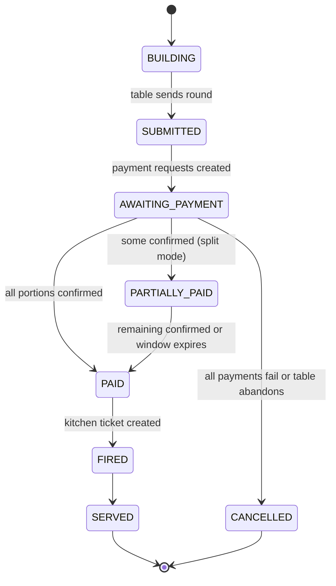

# OmniBite — Phase 1 Order and Payment State Machine

This defines how an order moves from QR scan to served food, where payment gates the kitchen, how a shared table splits and fires as one ticket, where eTIMS invoicing happens, and how refunds and failed payments resolve. It is the build reference for phase one.

The whole design rests on one rule: **the kitchen never receives a ticket for an unpaid round.** Everything below protects that.

---

## Entities

Six interacting lifecycles:

1. **Table Session** — one per occupied table, holds one or more Rounds.
2. **Round** — a batch of items submitted and paid together. The unit of pay-before-fire.
3. **Payment** — one per payer per round. Wraps M-Pesa, card, or cash.
4. **Kitchen Ticket** — created only when a Round is paid.
5. **eTIMS Invoice** — one per confirmed payment.
6. **Refund** — issued when paid food cannot be delivered or is rejected.

---

## 1. Table Session

| State | Meaning | Exit |
|---|---|---|
| ACTIVE | Created on first QR scan of the table. Diners join, build and pay rounds over time. | All rounds terminal and diners gone |
| SETTLED | Every round is served or cancelled. Nothing outstanding. | Staff marks bussing |
| NEEDS_BUSSING | Table empty, awaiting reset. | Staff resets |
| CLOSED | Table free again. | terminal |

Rule: a session **cannot leave ACTIVE while any round is non-terminal.** Because of pay-before-fire, a served table is always square, so there is no end-of-meal bill step. The diner simply leaves.

---

## 2. Round (the spine)

- **BUILDING**: open cart. Each diner's items are tagged to that diner. 86 checks run here, so an out-of-stock item cannot enter the round.
- **SUBMITTED**: the table sends the round. Items freeze. The table picks a settlement mode: SINGLE_PAYER (one person pays the whole round) or SPLIT (each diner pays their own tagged items). **No kitchen ticket exists yet.**
- **AWAITING_PAYMENT**: payment requests are created, one per payer. See section 3.
- **PARTIALLY_PAID** (split only): some payers confirmed, others pending. A payment window runs with nudges. If the window expires with portions still unpaid, those diners' items are pulled from the round and the rest proceeds. An unpaid item never blocks the table, and another diner can tap to cover it.
- **PAID**: every settled portion is confirmed. **This is the gate.** Reaching PAID does three things at once: creates the Kitchen Ticket (section 4), queues the eTIMS invoice per payment (section 5), and updates the floor map.
- **FIRED → SERVED**: handed to the kitchen ticket lifecycle.
- **CANCELLED**: all payments failed or the table abandoned. Nothing fired, no money held.

Edge: if an item in a PAID round is 86ed in the gap before firing, auto-issue a refund or credit for that item (section 6) and fire the remainder.

---

## 3. Payment (per payer, per round)

All payment types converge to **CONFIRMED** or **FAILED**. Nothing is allowed to rest in a pending state forever.

### M-Pesa (STK push)

| State | Trigger | Next |
|---|---|---|
| INITIATED | STK push sent with table ID in the account reference | PENDING |
| PENDING | Awaiting Daraja callback | CONFIRMED, FAILED, or UNKNOWN |
| UNKNOWN | Callback not received within timeout T | Query Daraja transaction status API, then resolve |
| CONFIRMED | Callback or status query returns success | terminal |
| FAILED | User cancelled, wrong PIN, insufficient balance, or timeout | terminal, retry offered |

Two non-negotiables:
- **Idempotency**: dedupe on the M-Pesa transaction reference so a duplicated or replayed callback never double-charges or double-fires.
- **Status-query backstop**: any PENDING that ages past T is resolved by an active status query, never left hanging.

### Card
AUTHORIZED → CAPTURED → CONFIRMED, or DECLINED → FAILED.

### Cash
Server records cash received → CONFIRMED. Reconciled against the drawer at end of shift.

---

## 4. Kitchen Ticket

Created **only** when a round reaches PAID.

| State | Meaning |
|---|---|
| QUEUED | Received at the KDS, split across stations |
| IN_PREP | Kitchen has started |
| READY | Bumped, at the pass |
| SERVED | Runner delivered; round moves to SERVED |

The whole round fires as one coursed ticket so the table eats together. If the KDS is offline, the ticket queues locally and syncs on reconnect. It was already paid, so nothing is at risk.

---

## 5. eTIMS Invoice

One invoice per **confirmed payment** (so a split round produces one invoice per payer, which also supports capturing a buyer PIN when a corporate diner wants to claim input tax).

| State | Meaning |
|---|---|
| PENDING | Queued for the eTIMS API |
| TRANSMITTED | KRA accepted; invoice number and QR returned, attached to the diner's SMS receipt |
| FAILED | eTIMS API unreachable; held in a retry queue |

**Critical decoupling: eTIMS transmission must never block firing the kitchen.** The kitchen fires on payment CONFIRMED. The invoice generates asynchronously and retries if KRA is down, so a tax-system outage never stops you serving food. The invoice is still legally required and will transmit once eTIMS recovers.

---

## 6. Refund

Triggered when paid food cannot be delivered (item 86ed after payment) or is rejected (wrong or unacceptable).

| State | Meaning |
|---|---|
| REQUESTED | Staff with the right role opens it, reason-coded |
| APPROVED | Manager PIN required above a set threshold |
| RESOLVED_CREDIT | Store credit issued (the default, since it is instant) |
| RESOLVED_REVERSAL | M-Pesa reversal initiated, then PENDING, then REVERSED or REVERSAL_FAILED |

Every refund also generates an **eTIMS credit note** transmitted to KRA, so tax records stay consistent. Every refund lands in the audit log with who, when, and why.

---

## End-to-end happy path

1. Diners scan the table QR. Session goes ACTIVE.
2. Each diner adds items from their phone. Round is BUILDING, items tagged per diner.
3. Table sends the round and picks SPLIT. Round is SUBMITTED, then AWAITING_PAYMENT.
4. Each diner gets an STK push, enters their PIN, pays. Each payment goes CONFIRMED.
5. Last portion confirms. Round goes PAID. Three things fire together: kitchen ticket QUEUED, eTIMS invoices queued per payer, floor map updated.
6. Kitchen preps and bumps. Ticket goes READY, runner serves, round goes SERVED.
7. Diners leave. The table is already square. Staff marks NEEDS_BUSSING, then CLOSED.

---

## Key unhappy paths

- **Dropped callback**: payment sits PENDING past T. Status query resolves it to CONFIRMED or FAILED. If CONFIRMED, the round proceeds normally; the diner was never blocked by the missing callback.
- **One diner does not pay (split)**: round sits PARTIALLY_PAID. Window expires, that diner's items drop, the rest fires. The table is not held hostage.
- **Insufficient balance or cancelled PIN**: payment FAILED, retry offered. If the table gives up, the round CANCELLES with no charge and nothing fired.
- **Item 86ed after payment, before fire**: auto refund or credit for that item, fire the rest.
- **eTIMS down at payment time**: kitchen fires anyway, invoice queues and retries. Service is never blocked by KRA availability.
- **KDS offline**: paid ticket queues locally, syncs on reconnect.

---

## Invariants (the rules that must always hold)

1. No kitchen ticket exists for a round that is not PAID.
2. Every CONFIRMED payment produces exactly one eTIMS invoice, idempotently.
3. eTIMS transmission never blocks firing the kitchen.
4. Every M-Pesa payment resolves to CONFIRMED or FAILED. None stays PENDING.
5. Every refund produces an eTIMS credit note and an audit log entry.
6. A session cannot close while any round is non-terminal.
7. An 86ed item can never enter a BUILDING round, and if 86ed after payment, it is auto-refunded.
